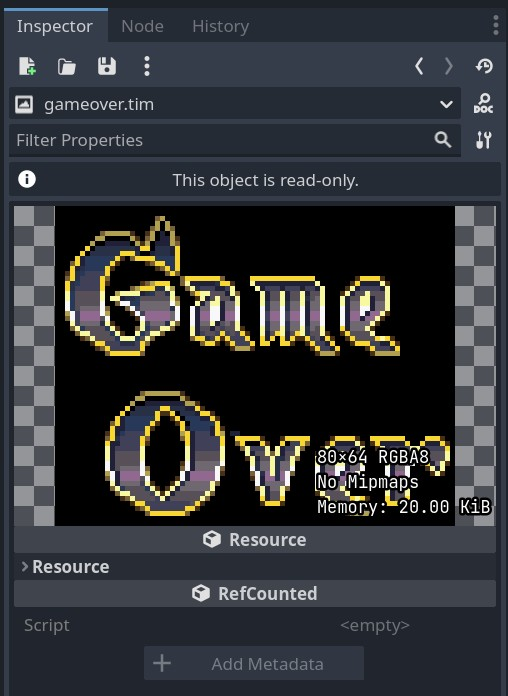

# tim_format for Godot

This addon allows Godot to import most TIM files from Playstation 1 games. It's not fully complete, but it was a fun side project to noodle away at.

# Resources

TIM File Format Spec - http://fileformats.archiveteam.org/wiki/TIM_(PlayStation_graphics)